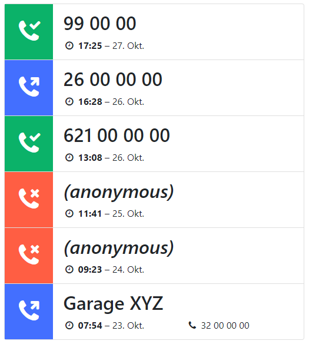

# Fritz!Box Call List

This small utility retrieves the call list from a [Fritz!Box](https://avm.de/produkte/fritzbox/) via its [TR-064 API](https://avm.de/service/schnittstellen/), and displays it in a web browser.

It additionally retrieves, for all Luxembourgish phone numbers (that is, starting with `+352`), the contact details from the national phone book [Editus](https://www.editus.lu/), if available.



## Installation

The utility is written in Javascript and requires [Node.js](https://nodejs.org/) to be installed.

To install all the dependencies, run:

```bash
npm install
```

Copy or rename the `config.example.js` file to `config.js` and adapt it according to your needs.
See the `config.example.js` file for more explanations on the format.

## Usage

Before launching the Fritz!Box Call List tool, verify that the `config.js` file exists, and run:

```bash
npm start
```

Then, open the address http://localhost:8080 in your web browser.

## License

This utility was developed by Steve Muller and is licensed under an MIT license.
See the [LICENSE](LICENSE.md) file for more information.
